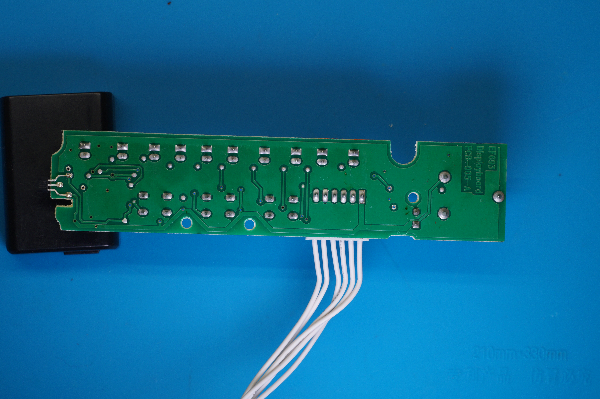
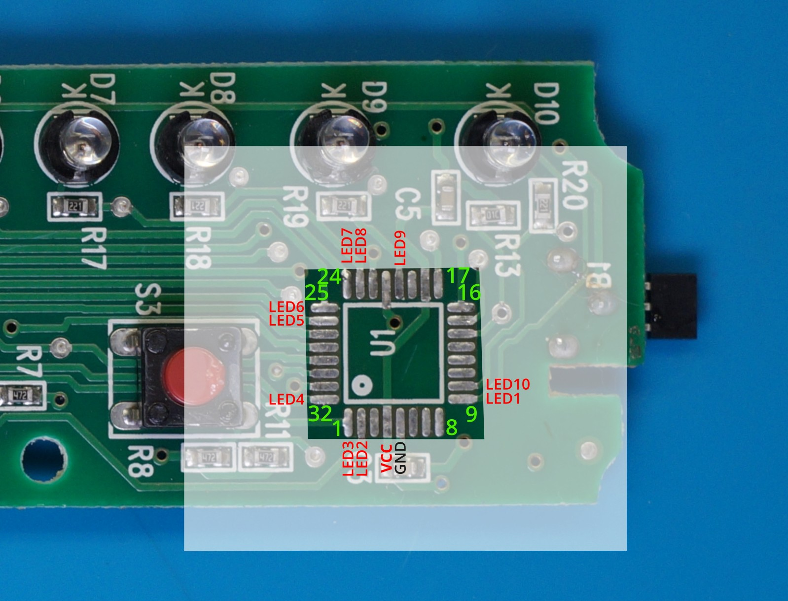

The project is about the reverse engineering of the Mellita Solo Perfect Milk coffee machine.

[Schematics](schematics)

## EF693 Main

MCU is ATmega324PA (TQFP)

Wiring:

MCU Pins:

## EF693 Disp

MCU is ATtiny48AU (TQFP)

MCU Pins:

Both of MCUs in my device are dead so I want try to make own controller.
