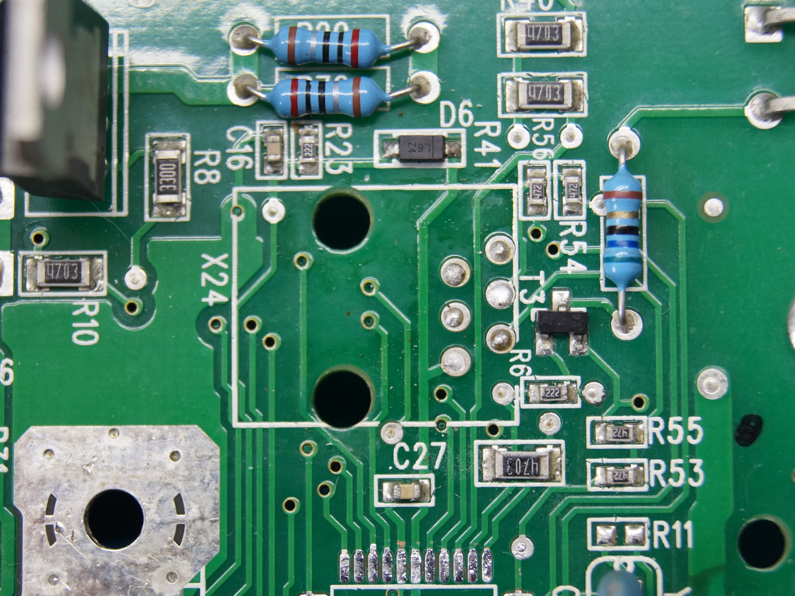

The project is about the reverse engineering of the Mellita Solo Perfect Milk coffee machine.

Both of MCUs in my device are dead so I want try to make own controller.

[Schematics](schematics)

⚠⚠⚠

The board is not galvanically isolated from the mains (AC220_N connected to +5V)! Disconnect the programmer from the computer when applying mains voltage to the board, otherwise something may blow up!

Or:

  - Use laptop with battery power

  - Power up board using transformer only (disconnect transformer from "Trafo" connector and connect transformer to 220v)

⚠⚠⚠

## EF693 Main

MCU is ATmega324PA (TQFP)

Top:

Under RJ12 (6P6C) connector:

Bottom:

Wiring:

MCU Pins:

## EF693 Disp

MCU is ATtiny48AU (TQFP)

Top:

Bottom:

MCU Pins:

For this project, I have replaced the ATtiny48A with the ATmega328P, which is often used in Arduino boards. The pinout is mostly compatible, but one modification is necessary.

## Brewing unit actuator

Work of cam mechanism - power on (parking)

[source](https://www.youtube.com/watch?v=c8QlqGzTjy4)

https://github.com/user-attachments/assets/4184253f-a59c-4510-841d-e7e167fd1758
